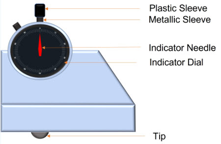

### Mould Hardness

Mould hardness is a numerical measure of how hard the mould has been rammed during preparation. Proper ramming ensures the mould retains its shape during pouring and solidification.

### Factors affecting mould hardness:

1.	Degree of ramming – More ramming increases hardness but may reduce permeability. 
2.	Percentage of sand – Higher sand content generally results in higher hardness. 
3.	Percentage of water – Optimum moisture is required for proper binding, but excess water can weaken the mould. 

### Mould Hardness Tester

The mould hardness tester is an indentation-type tester that functions similarly to the Brinell Hardness Tester. It measures the depth of penetration of an indenter into the mould surface.

### Working Principle:

●	The tester has a dial indicator with a range from 0 to 100. 
●	The indenter is a steel ball with a spring-loaded plunger that applies a controlled force. 
●	The depth of insertion (in hundredths of a millimetre) determines the hardness value. 
 
### Core Hardness

Core hardness is a numerical measure of bonding strength and hardness of baked or dried cores used in casting. Proper core hardness ensures dimensional accuracy and prevents defects during metal pouring.

### Factors affecting core hardness:

1.	Degree of ramming – Affects density and hardness. 
2.	Percentage of sand – Affects core structure. 
3.	Percentage of binder – Affects bonding strength and core hardness. 

### Core Hardness Tester

The core hardness tester is a scratch-type tester used to evaluate the surface hardness of cured cores.

### Working Principle:

●	The tester consists of a carbide-tipped plough that scratches the core surface. 

●	The dial indicator has a range from 0 to 100, providing a hardness reading. 

### Applications

●	Mould hardness tester: Measures the green mould hardness of sand moulds prepared by different methods (e.g., hand moulding, jolt squeeze moulding). 

●	Core hardness tester: Determines the hardness of baked/dried cores made from core sands, resin sands, and other core materials. 

### Precautions

1.	Keep the instrument clean and free from dust. 
2.	Ensure no sand particles are stuck on the tester before and after each test. 
3.	Do not tamper with calibration settings to maintain accuracy.
